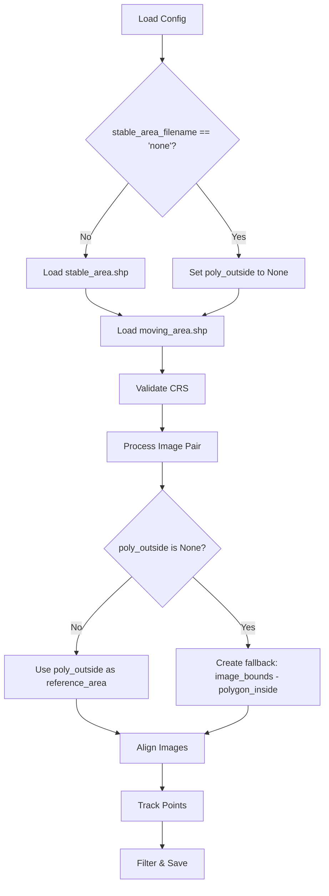

# Stable Area Fallback Feature Implementation Plan

## Overview
Implement an optional fallback mode for image alignment when no stable area Shapefile is provided. When `stable_area_filename` is set to "none", the system will assume all areas outside the moving area (polygon_inside) are stable, using `image_bounds.difference(polygon_inside)` as the reference area for alignment.

## Current Architecture

### Key Components
1. **Configuration** (`configs/example_config.toml`):
   - `stable_area_filename` - Currently **required** (line 10)
   - `moving_area_filename` - Currently **required** (line 11)

2. **Pipeline** (`src/PyImageTrack/run_pipeline.py`):
   - Lines 190-191: Both polygon filenames are required via `_require()`
   - Lines 308-309: Both polygons are loaded from files
   - Line 495: `polygon_outside` is passed to `image_pair.align_images()`

3. **Alignment** (`src/PyImageTrack/ImageTracking/AlignImages.py`):
   - Lines 43-45: Raises ValueError if reference_area is empty
   - Lines 52-54: Calculates polygon area for grid spacing
   - Lines 58-62: Generates control point grid on reference_area

4. **ImagePair** (`src/PyImageTrack/ImageTracking/ImagePair.py`):
   - Lines 342-382: `align_images()` method processes reference_area
   - Lines 358-360: Intersects reference_area with image_bounds
   - Lines 197-202, 271-275: `image_bounds` is computed during image loading

## Proposed Changes

### 1. Configuration Changes (`configs/example_config.toml`)

```toml
[polygons]
# can be set to "none" to use image_bounds minus moving_area as stable area
# (this assumes all areas outside the moving area are stable; alignment quality may be
#  slightly lower but can be improved by increasing number_of_control_points)
stable_area_filename = "stable_area.shp"
moving_area_filename = "moving_area.shp"
```

### 2. Pipeline Changes (`src/PyImageTrack/run_pipeline.py`)

**Lines 190-191**: Change from `_require()` to `_get()` with default "none"
```python
poly_outside_filename = _get(cfg, "polygons", "stable_area_filename", "none")
poly_inside_filename = _require(cfg, "polygons", "moving_area_filename")
```

**Lines 308-329**: Handle optional polygon_outside loading
```python
# Load polygons
poly_outside = None
poly_outside_filename_resolved = _as_optional_value(poly_outside_filename)
if poly_outside_filename_resolved is not None:
    poly_outside = gpd.read_file(os.path.join(input_folder, poly_outside_filename_resolved))
    if use_no_georeferencing:
        poly_outside = poly_outside.set_crs(None, allow_override=True)

polygon_inside = gpd.read_file(os.path.join(input_folder, poly_inside_filename))
if use_no_georeferencing:
    polygon_inside = polygon_inside.set_crs(None, allow_override=True)

# CRS validation
if poly_outside is not None:
    polygon_outside_crs = poly_outside.crs
    polygon_inside_crs = polygon_inside.crs
    # ... existing CRS validation ...
    polygons_crs = polygon_outside_crs
else:
    # When poly_outside is None, use polygon_inside CRS
    polygons_crs = polygon_inside.crs
```

**Lines 494-496**: Handle fallback stable area creation
```python
if not used_cache_alignment:
    print("Starting image alignment.")
    # When poly_outside is None, align_images will use image_bounds minus polygon_inside
    image_pair.align_images(polygon_outside, polygon_inside=polygon_inside)
```

**Lines 571-592**: Update LoD calculation to handle None polygon_outside
```python
if not used_cache_lod:
    if poly_outside is not None:
        lod_points = random_points_on_polygon_by_number(
            poly_outside,
            filter_params.number_of_points_for_level_of_detection
        )
    else:
        # Use image_bounds minus moving_area for LoD calculation
        lod_points = random_points_on_polygon_by_number(
            image_pair.image_bounds.difference(polygon_inside),
            filter_params.number_of_points_for_level_of_detection
        )
    image_pair.calculate_lod(lod_points, filter_parameters=filter_params)
```

### 3. ImagePair Changes (`src/PyImageTrack/ImageTracking/ImagePair.py`)

**Lines 342-382**: Update `align_images()` signature and logic
```python
def align_images(self, reference_area: gpd.GeoDataFrame,
                 polygon_inside: gpd.GeoDataFrame = None) -> None:
    """
    Aligns the two images based on matching the given reference area.
    
    Parameters
    ----------
    reference_area: gpd.GeoDataFrame or None
        A one-element GeoDataFrame containing the area in which the points are defined to align the two images.
        If None, will use image_bounds minus polygon_inside as the stable area.
    polygon_inside: gpd.GeoDataFrame, optional
        The moving area polygon. Required when reference_area is None.
    """
    # Handle fallback mode when reference_area is None
    if reference_area is None:
        if polygon_inside is None:
            raise ValueError(
                "polygon_inside must be provided when reference_area is None."
            )
        reference_area = gpd.GeoDataFrame(
            geometry=self.image_bounds.difference(polygon_inside),
            crs=self.crs
        )
        reference_area = reference_area.rename(columns={0: 'geometry'})
        reference_area.set_geometry('geometry', inplace=True)
        logging.warning(
            "[FALLBACK] Using image_bounds minus moving_area as stable area. "
            "This may result in slightly lower alignment quality. "
            "Consider increasing number_of_control_points to compensate."
        )
    
    # Existing validation and processing
    if reference_area.crs != self.crs:
        raise ValueError("Got reference area with crs " + str(reference_area.crs) + " and images with crs "
                         + str(self.crs) + ". Reference area and images are supposed to have the same crs.")
    
    reference_area = gpd.GeoDataFrame(reference_area.intersection(self.image_bounds))
    reference_area.rename(columns={0: 'geometry'}, inplace=True)
    reference_area.set_geometry('geometry', inplace=True)
    
    # Check if reference_area is empty after intersection
    if len(reference_area) == 0 or reference_area.geometry.iloc[0].is_empty:
        raise ValueError(
            "Reference area is empty after intersection with image bounds. "
            "This may happen if the moving area covers the entire image."
        )
    
    # ... rest of existing code ...
```

### 4. AlignImages.py Changes

**Lines 43-45**: Update error message to be more informative
```python
if len(reference_area) == 0:
    raise ValueError(
        "No polygon provided in the reference area GeoDataFrame. "
        "Please provide a GeoDataFrame with exactly one element, or set stable_area_filename to 'none' "
        "to use image_bounds minus moving_area as the stable area."
    )
```

## Implementation Flow



## Key Considerations

1. **Backward Compatibility**: Existing configs with `stable_area_filename` set will continue to work unchanged.

2. **Fallback Quality**: The fallback mode may have slightly lower alignment quality because:
   - The stable area includes regions that might have some movement
   - This can be mitigated by increasing `number_of_control_points`

3. **Validation**: The system will validate that:
   - If `stable_area_filename` is "none", `polygon_inside` must be provided
   - The resulting reference area is not empty after intersection

4. **Logging**: Clear warnings will be logged when fallback mode is active.

5. **CRS Handling**: When `poly_outside` is None, CRS validation uses `polygon_inside.crs`.

## Testing Checklist

- [ ] Test with existing config (stable_area.shp provided)
- [ ] Test with fallback mode (stable_area_filename = "none")
- [ ] Test error when stable_area_filename = "none" but moving_area not provided
- [ ] Test alignment quality with fallback mode
- [ ] Test with increased number_of_control_points
- [ ] Test LoD calculation with fallback mode
- [ ] Test with no_georeferencing mode
- [ ] Verify cache compatibility